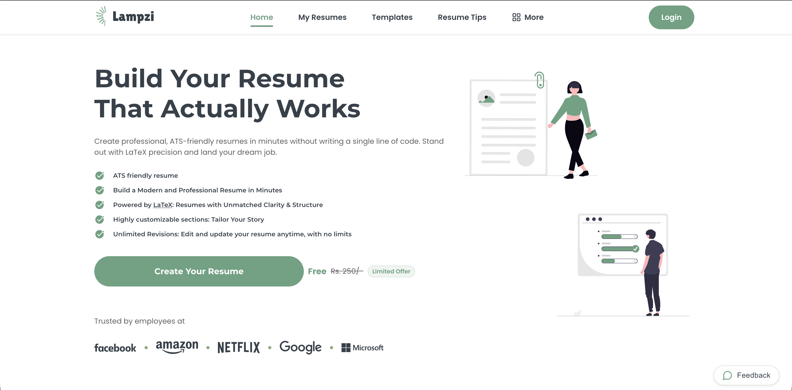
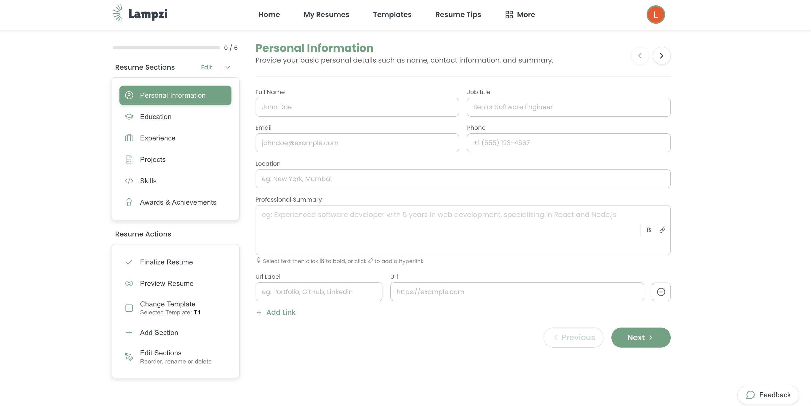
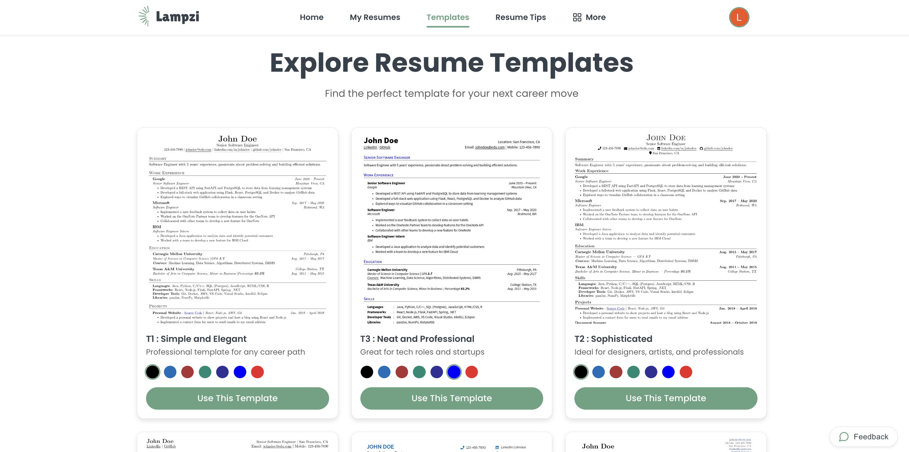

# 💡 Lampzi — The LaTeX Resume Architect

**The precision of LaTeX meets the simplicity of no-code. Built for the 6-second recruiter scan.**

[Features](#-key-features) • [Why Lampzi](#-the-lampzi-standard) • [Templates](#-recruiter-validated-templates) • [Comparison](#-lampzi-vs-the-world) • [Tech Stack](#-tech-stack)

---

## 🎯 What is Lampzi?

[Lampzi](https://lampzi.com) is a professional [LaTeX resume builder](https://lampzi.com) designed for job seekers who value structure, clarity, and technical precision. 

Most resume builders focus on "pretty" designs that break when you edit them or fail when scanned by an **Applicant Tracking System (ATS)**. Lampzi treats resume building as **document engineering**. By leveraging the mathematical spacing of LaTeX, we ensure your resume is typographically perfect and 100% readable by both bots and humans.

### 🔥 Perfect For:
- 👨‍💻 **Tech Professionals** – Showcase complex projects and skill stacks with clean hierarchy.
- 🎓 **Students & New Grads** – Turn academic achievements into professional narratives.
- 💼 **Active Job Seekers** – Optimized for the "6-second scan" to get you more interviews.
- 🔬 **PhD & Researchers** – Handle heavy content without sacrificing whitespace.

---

## ✨ Key Features

### 📐 **LaTeX-Powered Precision**
No more fighting with Word margins or CSS grid bugs. Lampzi uses LaTeX behind the scenes to ensure impeccable alignment and consistent mathematical spacing.

### 🤖 **ATS-First Architecture**
Our templates are built with structured data. While other builders produce "flat" PDFs, Lampzi generates clean, parsable documents that score **90-99% on ATS scanners** like Workday, Greenhouse, and Lever.

### ⚡ **No-Code Interface**
Get the "Overleaf look" without writing a single line of code. Edit your details through an intuitive form and see your professional PDF update in real-time.

### 📱 **Mobile-Optimized Editing**
The only LaTeX-based editor that works seamlessly on your phone. Refine your bullets or swap a template while on the go.

### 🎯 **Smart Section Management**
- **Drag-and-Drop Reordering:** Change your resume flow in seconds.
- **Custom Sections:** Add "Open Source," "Certifications," or "Volunteering" with one click.
- **Rename & Hide:** Complete control over your document's headers.

---

## 🏆 The Lampzi Standard

Recruiters spend an average of **6 seconds** on an initial screen. If your resume is cluttered, they move on. 

We follow a "Structure-First" philosophy:
1. **Mathematical Whitespace:** Guiding the eye to your most important achievements.
2. **Typographical Hierarchy:** Consistent font weights that make your titles pop.
3. **Outcome-Focused Layouts:** Designed to highlight *impact*, not just tasks.

[**Build your best resume today at lampzi.com →**](https://lampzi.com)

---

## 📋 Recruiter-Validated Templates

| Template Style | Best For | Focus |
|:--- |:--- |:--- |
| **The Minimalist** | Software Engineers / Data Science | Clean lines, high density |
| **The Executive** | Management / MBA | Leadership & Impact focus |
| **The Academic** | Researchers / PhDs | Publication & Project heavy |
| **The Modern** | Career Changers | Hybrid skills & experience |

---

## 📸 Screenshots

  
  

---

## 🌟 Lampzi vs. The World

| Feature | Lampzi | Canva/Word | Overleaf |
| :--- | :---: | :---: | :---: |
| **ATS Compatibility** | ✅ 99% | ❌ Low | ✅ High |
| **Zero-Code Required** | ✅ Yes | ✅ Yes | ❌ No |
| **Layout Stability** | ✅ Never Breaks | ❌ Constant Fighting | ✅ Solid |
| **Professional Typography** | ✅ LaTeX Grade | ❌ Standard | ✅ LaTeX Grade |
| **Mobile Friendly** | ✅ Yes | ✅ Yes | ❌ No |

---

## 🔗 Quick Links & Resources

- 🌐 **Official Website:** [lampzi.com](https://lampzi.com)
- 📝 **Resume Templates:** [Browse ATS Templates](https://lampzi.com/templates)
- 📚 **Career Blog:** [Resume Writing Guides](https://lampzi.com/blogs)
- 💡 **Resume tips:** [Resume Golden Tips](https://lampzi.com/tips)

---

## 📈 SEO Keywords
`resume builder`, `latex resume`, `ats friendly resume`, `professional resume maker`, `cv builder`, `no-code latex`, `software engineer resume`, `academic cv template`, `best latex resume builder 2026`, `no code latex resume builder`, `overleaf alternative`, `job application tools`.

---

**Built with ❤️ for the ambitious professional.**

[Get Started for Free](https://lampzi.com/) • [Star this Repo](https://github.com/lampzi/latex-resume-builder)

